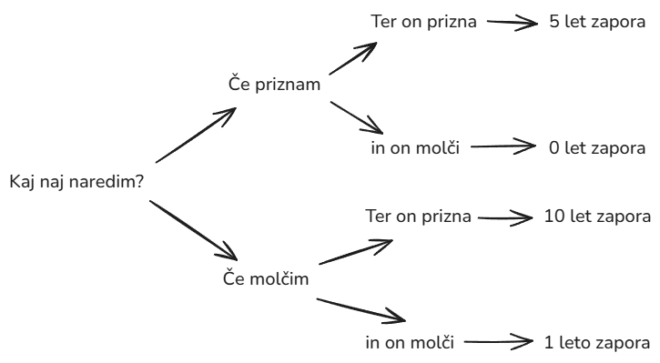
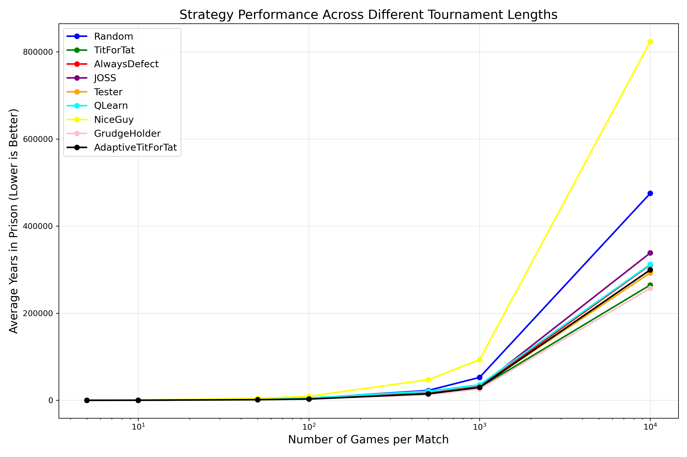
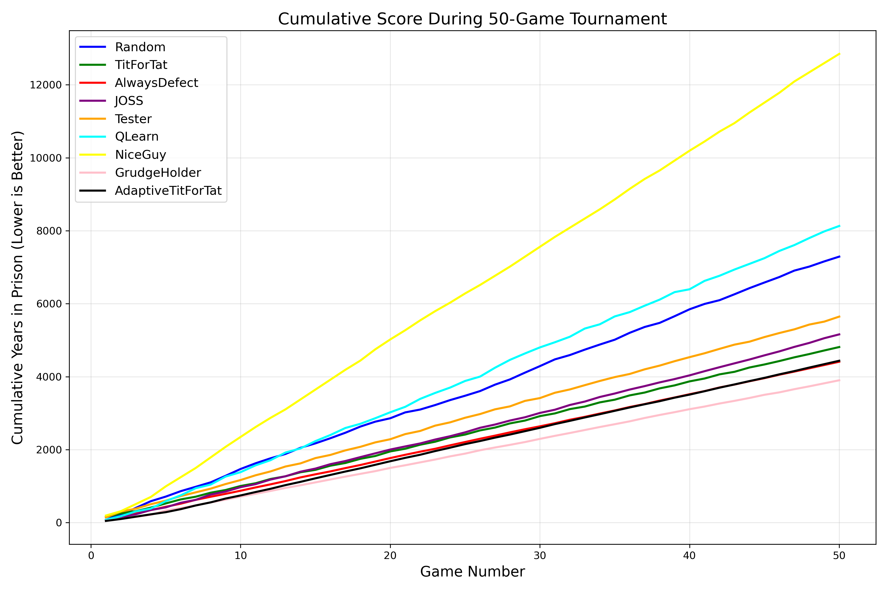
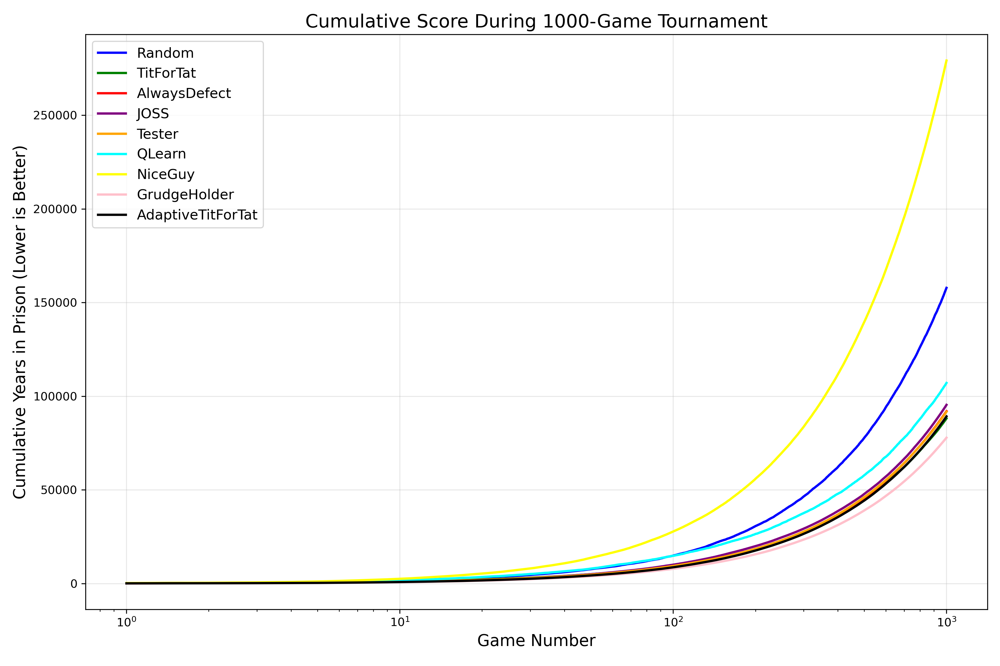
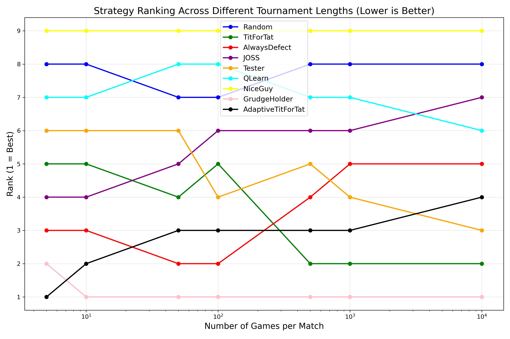
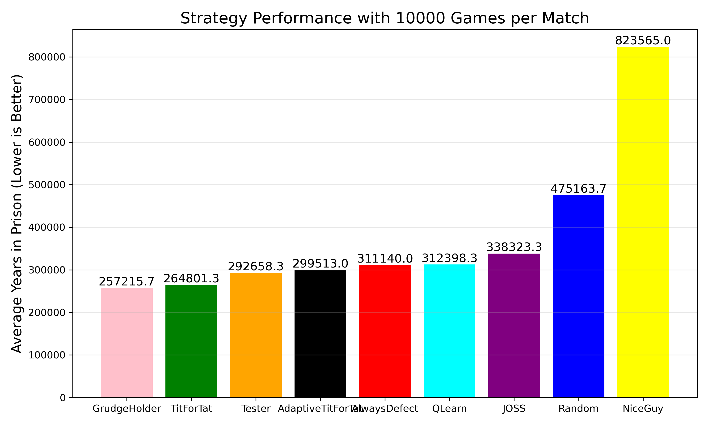
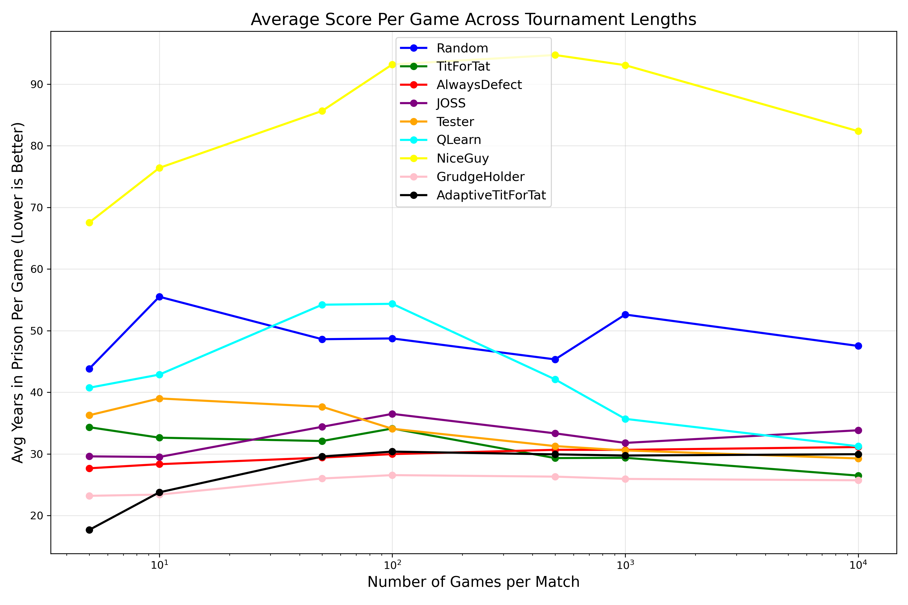

# Projekt 9 – Implementacija igre Iterativna zapornikova dilema

## Definicija problema

V tej nalogi se ukvarjamo z implementacijo igre "Iterativna zapornikova dilema". Osnovni problem izhaja iz realnega sveta, kjer se posamezniki soočajo z dilemami med sodelovanjem in izdajo, vendar je koncept igre umetno ustvarjen za simulacijo medsebojnega sodelovanja v več ponovljenih interakcijah. Igra temelji na matematični formulaciji, kjer je cilj vsakega agenta maksimizirati svojo korist. Matematično je možno definirati korist agenta \(i\) kot:

$$
U_i = \sum_{t=1}^{T} u_i(t)
$$

kjer je:

- $U_i$ skupna korist agenta $i$,
- $T$ število iteracij igre,
- $u_i(t)$ korist, ki jo agent $i$ doseže v $t$-ti iteraciji.

Problem se dotika ključnih vprašanj strategij odločanja in merjenja učinkovitosti različnih pristopov pri iterativni igri.  
**Ključne besede:** iterativna zapornikova dilema, strategije, sodelovanje, evalvacija, Axelrod

## Pregled sorodnih del in pregled evaluacije rešitve problema

Pregled literature kaže, da so raziskovalci že dolgo preučujejo dileme med sodelovanjem in izdajo. Pomembni viri vključujejo:

- [M. Jurišić, D. Kermek and M. Konecki, "A review of iterated prisoner's dilemma strategies," 2012 Proceedings of the 35th International Convention MIPRO, Opatija, Croatia, 2012, pp. 1093-1097. keywords: {Thin film transistors;Games;Educational institutions;Noise;Game theory;Economics;Biological system modeling}](https://ieeexplore.ieee.org/abstract/document/6240806)
- [Wikipedia: The Evolution of Cooperation](https://en.wikipedia.org/wiki/The_Evolution_of_Cooperation)
- [William H. Press, and Freeman J. Dysonb: "Iterated Prisoner’s Dilemma contains strategies that dominate any evolutionary opponent"](https://www.pnas.org/doi/epdf/10.1073/pnas.1206569109)
- [Bravetti, A., Padilla, P. An optimal strategy to solve the Prisoner’s Dilemma. Sci Rep 8, 1948 (2018).](https://www.nature.com/articles/s41598-018-20426-w)

Evaluacija rešitev v tem področju se pogosto izvaja z naslednjimi metodami:

- **Simulacijska analiza:** Izvajanje večkratnih iteracij igre in primerjava povprečne koristi različnih strategij.
- **Analiza stabilnosti:** Preučevanje, katera strategija dosega stabilno ravnovesje (npr. Nashovo ravnovesje - Nash Equilibrium) v iterativni igri.
- **Statistična primerjava:** Uporaba statističnih metod za primerjavo rezultatov turnirjev med različnimi strategijami.
- **Eksperimentalna validacija:** Izvajanje eksperimentov s simulacijami turnirja, kot ga je predlagal Axelrod, in preverjanje hipoteze o prednosti sodelovanja pri večkratnem ponavljanju igre.

## Strategije v igri Prisoner's Dilemma

V igri Prisoner's Dilemma igralci ponavljajo dilemo zapornikov in sprejemajo odločitve o sodelovanju ali izdaji. Različne strategije določajo, kako igralec sprejema odločitve glede na prejšnje poteze nasprotnika. Spodaj so opisane strategije, katere bomo implementirali:

### Tit for Tat (Tit4Tat)

- Strategija začne s sodelovanjem.
- Nato ponavlja potezo nasprotnika iz prejšnje runde (če je nasprotnik v prejšnji rundi sodeloval, sodeluje tudi Tit4Tat, če je nasprotnik izdal, tudi Tit4Tat izda).
- Ta strategija nagrajuje sodelovanje in kaznuje izdajo.

### Always Defect (ALL-D)

- Igralec vedno izda ne glede na zgodovino igre.
- Ta strategija je agresivna in deluje dobro proti sodelovalnim strategijam, vendar je slaba proti drugim strategijam, ki kaznujejo izdajo.

### Random

- Igralec naključno izbira med sodelovanjem in izdajo z določeno verjetnostjo.
- Ta strategija je nepredvidljiva, vendar lahko deluje slabše proti bolj strateškim nasprotnikom.

### Tester

- Strategija začne z izdajo, da preveri odziv nasprotnika.
- V drugem krogu sodeluje, da vidi, kako nasprotnik reagira na začetno izdajo.
- Če je nasprotnik v drugem krogu kaznoval začetno izdajo (z izdajo), strategija preklopi na tit-for-tat pristop in ponavlja zadnjo potezo nasprotnika.
- Če nasprotnik ni kaznoval začetne izdaje (je še naprej sodeloval), ga strategija izkorišča z nadaljnjimi izdajami.
- Ta pristop omogoča testiranje nasprotnikove strategije in prilagajanje lastnega vedenja glede na njegove odzive.

### JOSS

- Podobna strategiji Tit4Tat, vendar občasno izda, tudi če bi Tit4Tat sicer sodeloval.
- Običajno ima majhno verjetnost izdaje (npr. 10 %), kar otežuje popolno sodelovanje nasprotnika.
- Ta strategija je bolj manipulativna, saj izkorišča preveč sodelovalne nasprotnike.

Vsaka strategija ima svoje prednosti in slabosti, odvisno od tega, proti komu igra. Pri ponavljajočih se igrah lahko določene strategije (npr. Tit4Tat) vzpostavijo dolgoročno sodelovanje, medtem ko druge (npr. ALL-D) izkoristijo sodelovalne nasprotnike.

## Načrt rešitve

Za implementacijo projekta smo pripravili naslednji načrt:

### Izbrana projektna skupina in sodelavci

- **Projektna skupina:** S7
- **Sodelavci:** Matic Lukežič, Tim Trojner Hlade, Dejan Tominc

### Povezava do repozitorija

- [Git repozitorij projekta](https://github.com/TimTrojner/psis-prisoners-dilemma)

### Izbran programski jezik

- Python

### Opravila in razvojne iteracije

Projekt bomo implementirali v štirih razvojnih iteracijah:

- [ ] **Iteracija 1:** Načrtovanje in postavitev osnovne strukture projekta. V tej fazi bomo definirali osnovne razrede in module za simulacijo igre ter pripravo podatkov za evalvacijo.
- [ ] **Iteracija 2:** Implementacija osnovnih strategij: ALL-D, RANDOM in TIT-FOR-TAT. V tej fazi bomo zagotovili, da strategije pravilno odločajo glede sodelovanja ali izdaje.
- [ ] **Iteracija 3:** Implementacija dodatnih strategij: TESTER in JOSS. Prav tako bomo integrirali evalvacijske metode za merjenje uspešnosti strategij preko simulacij.
- [ ] **Iteracija 4:** Razvoj lastne strategije, izvedba celovitega turnirja po Axelrodovih principih in optimizacija kode na podlagi rezultatov ter zaključna dokumentacija.

### Diagram razredov

### Diagram odločitev primer

Prikaz s pomočjo tabele:

|               | Jaz molčim                    | Jaz priznam                  |
| ------------- | ----------------------------- | ---------------------------- |
| **On molči**  | **Jaz** 1 leto, **On** 1 leto | **Jaz** 20 let, **On** 0 let |
| **On prizna** | **Jaz** 0 let, **On** 20 let  | **Jaz** 5 let, **On** 5 let  |

# Projekt 9 – Implementacija igre Iterativna zapornikova dilema

**Avtorji:** Matic Lukežič, Tim Trojner Hlade, Dejan Tominc

## Povzetek

Ta projekt se osredotoča na implementacijo in analizo različnih strategij v kontekstu ponavljajoče se Zapornikove dileme. Razvit je bil simulacijski model v programskem jeziku Python, ki omogoča medsebojno tekmovanje implementiranih strategij, vključno s klasičnimi strategijami, kot so Tit-for-Tat, Always Defect, Random, JOSS, Tester, ter naprednejšimi, kot sta Q-Learning igralec, Adaptive Tit-for-Tat ter Grudge Holder. Cilj projekta je bil preučiti dinamiko interakcij med strategijami skozi turnirje z različnim številom iteracij in identificirati dejavnike, ki prispevajo k njihovi uspešnosti. Poročilo opisuje teoretično ozadje, metodologijo razvoja programske rešitve, predstavitev implementiranih strategij ter analizo rezultatov simulacij, vključno z vizualizacijami uspešnosti.

## Uvod

V tej nalogi se ukvarjamo z implementacijo igre "Iterativna zapornikova dilema". Osnovni problem izhaja iz realnega sveta, kjer se posamezniki soočajo z dilemami med sodelovanjem in izdajo, vendar je koncept igre umetno ustvarjen za simulacijo medsebojnega sodelovanja v več ponovljenih interakcijah. Igra temelji na matematični formulaciji, kjer je cilj vsakega agenta maksimizirati svojo korist (v našem primeru minimizirati zaporno kazen). Matematično je možno definirati korist agenta $i$ kot:

$$
U_i = \sum_{t=1}^{T} u_i(t)
$$

kjer je:

- $U_i$ skupna korist agenta $i$,
- $T$ število iteracij igre,
- $u_i(t)$ korist, ki jo agent $i$ doseže v $t$-ti iteraciji.

Problem se dotika ključnih vprašanj strategij odločanja in merjenja učinkovitosti različnih pristopov pri iterativni igri.
**Ključne besede:** iterativna zapornikova dilema, strategije, sodelovanje, evalvacija, Axelrod, Q-učenje.

## Sorodna dela

Pregled literature kaže, da so raziskovalci že dolgo preučujejo dileme med sodelovanjem in izdajo. Pomembni viri vključujejo:

- [M. Jurišić, D. Kermek and M. Konecki, "A review of iterated prisoner's dilemma strategies," 2012 Proceedings of the 35th International Convention MIPRO, Opatija, Croatia, 2012, pp. 1093-1097.](https://ieeexplore.ieee.org/abstract/document/6240806)
- [Wikipedia: The Evolution of Cooperation](https://en.wikipedia.org/wiki/The_Evolution_of_Cooperation)
- [William H. Press, and Freeman J. Dysonb: "Iterated Prisoner’s Dilemma contains strategies that dominate any evolutionary opponent"](https://www.pnas.org/doi/epdf/10.1073/pnas.1206569109)
- [Bravetti, A., Padilla, P. An optimal strategy to solve the Prisoner’s Dilemma. Sci Rep 8, 1948 (2018).](https://www.nature.com/articles/s41598-018-20426-w)

Evaluacija rešitev v tem področju se pogosto izvaja z naslednjimi metodami:

- **Simulacijska analiza:** Izvajanje večkratnih iteracij igre in primerjava povprečne koristi različnih strategij.
- **Analiza stabilnosti:** Preučevanje, katera strategija dosega stabilno ravnovesje (npr. Nashovo ravnovesje) v iterativni igri.
- **Statistična primerjava:** Uporaba statističnih metod za primerjavo rezultatov turnirjev med različnimi strategijami.
- **Eksperimentalna validacija:** Izvajanje eksperimentov s simulacijami turnirja, kot ga je predlagal Axelrod, in preverjanje hipoteze o prednosti sodelovanja pri večkratnem ponavljanju igre.

## Metodologija (Naša rešitev)

Za implementacijo in analizo iterativne Zapornikove dileme smo razvili programsko rešitev v jeziku Python. Osnova rešitve je v datoteki `src/main.py`, ki upravlja s turnirji, in modulu `src/playground.py`, ki definira okolje za posamezno igro med dvema igralcema. Strategije igralcev so definirane v ločenih datotekah znotraj direktorija `src/players/`.

### Implementirane Strategije

Implementirali smo naslednje strategije:

- **Random (`Random`)**: Naključno izbira med sodelovanjem in izdajo.
- **Tit for Tat (`TIT_FOR_TAT`)**: Začne s sodelovanjem, nato ponovi nasprotnikovo zadnjo potezo.
- **Always Defect (`ALL_D`)**: Vedno izda.
- **JOSS (`JOSS`)**: Podobna Tit-for-Tat, vendar z majhno verjetnostjo izda, tudi če bi sicer sodelovala.
- **Tester (`Tester`)**: Začne z izdajo, nato sodeluje. Če nasprotnik kaznuje, preklopi na Tit-for-Tat, sicer ga izkorišča.
- **Nice Guy (`NICE_GUY`)**: Vedno sodeluje (podobno AlwaysCooperate).
- **Grudge Holder (`GrudgeHolder`)**: Sodeluje, dokler nasprotnik ne izda. Po prvi izdaji nasprotnika začne "držati zamero" in izda v naslednjih nekaj krogih (trajanje zamere je nastavljivo). Po izteku zamere ponudi odpuščanje s sodelovanjem; če nasprotnik sprejme (sodeluje), se strategija vrne k sodelovanju, sicer ponovno začne držati zamero. Ta strategija omogoča kaznovanje izdaje, a tudi možnost odpuščanja, če nasprotnik spremeni vedenje.
- **Adaptive Tit for Tat (`AdaptiveTitForTat`)**: Prilagodljiva različica Tit-for-Tat, ki lahko spreminja svoje obnašanje.
- **Q-Learning Player (`QLearningPlayer`)**: Igralec, ki se uči optimalne strategije s pomočjo Q-učenja. Uporablja pretekle poteze (stanje) za odločanje in posodablja svojo Q-tabelo na podlagi prejetih nagrad.

### Q-Learning Igralec

Posebna pozornost je bila namenjena implementaciji Q-Learning igralca. Ta igralec se najprej trenira skozi veliko število iger (`train_q_table` funkcija v `main.py`) proti ostalim strategijam, da zgradi svojo Q-tabelo. Parametri učenja, kot so stopnja učenja (`learning_rate`), znižani faktor (`discount_factor`) in stopnja raziskovanja (`exploration_rate`), so nastavljivi. Za turnir se uporabi predhodno naučena Q-tabela z nižjo stopnjo raziskovanja za bolj dosledno delovanje.

### Simulacijski Pogon in Turnir

Simulacijski pogon (`tournament_round` in `run_tournament` v `main.py`) omogoča izvedbo turnirjev, kjer vsaka strategija igra proti vsaki drugi strategiji določeno število iger (krogov). Izvajamo turnirje z različnim številom iger na dvoboj (npr. 5, 10, 50, 100, 500, 1000, 10000 iger), da opazujemo, kako dolžina interakcije vpliva na uspešnost strategij. Za zmanjšanje vpliva naključnosti se rezultati povprečijo čez več ponovitev celotnega turnirja.

Standardna matrika izplačil (kazni v letih zapora, nižje je bolje) za igro je definirana tako:

|               | Jaz molčim                    | Jaz priznam                  |
| ------------- | ----------------------------- | ---------------------------- |
| **On molči**  | **Jaz** 1 leto, **On** 1 leto | **Jaz** 20 let, **On** 0 let |
| **On prizna** | **Jaz** 0 let, **On** 20 let  | **Jaz** 5 let, **On** 5 let  |

### Vizualizacija Rezultatov

Za analizo in prikaz rezultatov se uporablja knjižnica `matplotlib`. Generirajo se različni grafi, ki prikazujejo:

- Uspešnost strategij glede na različne dolžine turnirjev.
- Kumulativni rezultati strategij med potekom posameznega dvoboja.
- Rangiranje strategij.
- Primerjalni stolpčni diagrami za specifične dolžine turnirjev.
- Normalizirani rezultati (povprečna kazen na igro).

## Poskusi in rezultati

Izvedli smo serijo simulacijskih eksperimentov za oceno uspešnosti implementiranih strategij.

### Postavitev Eksperimentov

1.  **Trening Q-Learning Agenta:** Q-Learning agent je bil najprej treniran v `500,000` igrah proti ostalim sedmim strategijam (`TIT_FOR_TAT`, `ALL_D`, `Random`, `JOSS`, `Tester`, `GrudgeHolder`, `AdaptiveTitForTat`). Parametri učenja med treningom so bili: `learning_rate=0.2`, `discount_factor=0.99`, `exploration_rate=0.3`, `history_length=3`.
2.  **Turnirji:** Izvedeni so bili turnirji, kjer je vsaka od devetih strategij (vključno z naučenim Q-Learning agentom z `learning_rate=0.05`, `exploration_rate=0.05`) igrala proti vsaki drugi.
    - Število iger na dvoboj (`num_games_options`): 5, 10, 50, 100, 500, 1000, 10000.
    - Število ponovitev celotnega turnirja za vsako nastavitev števila iger (`num_tournaments`): 3 (za povprečenje rezultatov).

### Zbrani Podatki in Analiza

Za vsako strategijo smo beležili skupno število "let v zaporu" (nižja vrednost je boljša). Rezultati so bili povprečeni čez `num_tournaments` ponovitev.

Iz `main.py` je razvidno, da se generirajo naslednje vizualizacije, ki omogočajo podrobno analizo (dejanski grafi so shranjeni kot .png datoteke):

1.  **`strategy_performance_by_game_count.png`**: Prikazuje povprečno zaporno kazen za vsako strategijo v odvisnosti od števila iger v dvoboju. To omogoča vpogled, katere strategije so boljše v krajših ali daljših interakcijah.
      
    _Slika 1: Povprečna zaporna kazen za vsako strategijo v odvisnosti od števila iger v dvoboju._

2.  **`cumulative_score_{num_games}_games.png`**: Za izbrane dolžine dvobojev (npr. 10, 100, 1000 iger) prikazuje kumulativno zaporno kazen med potekom dvoboja. To lahko razkrije dinamiko med strategijami.
      
    _Slika 2: Kumulativna zaporna kazen med potekom dvoboja za 50 iger._

      
    _Slika 3: Kumulativna zaporna kazen med potekom dvoboja za 10000 iger._

3.  **`strategy_ranking_by_game_count.png`**: Prikazuje rang vsake strategije (1 = najboljša) glede na število iger v dvoboju, kar olajša primerjavo relativne uspešnosti.
      
    _Slika 4: Rangiranje strategij v odvisnosti od števila iger v dvoboju._
4.  **`strategy_comparison_{num_games}_games.png`**: Stolpčni diagrami, ki primerjajo uspešnost strategij za specifične dolžine dvobojev (npr. 10, 100, 10000 iger).
      
    _Slika 5: Primerjava uspešnosti strategij za 10000 iger v dvoboju._ 5. **`normalized_scores_by_game_count.png`**: Prikazuje povprečno zaporno kazen na eno igro, kar normalizira rezultate glede na dolžino dvoboja.
      
     _Slika 6: Normalizirane povprečne kazni strategij glede na število iger v dvoboju._

Na splošno se pričakuje, da bodo strategije, ki spodbujajo sodelovanje, a hkrati kaznujejo izdajo (kot TitForTat ali prilagodljive strategije), dolgoročno uspešne. Q-Learning agent ima potencial, da se nauči zelo učinkovite strategije, odvisno od kakovosti treninga in kompleksnosti okolja.

## Zaključek

Projekt je uspešno implementiral simulacijsko okolje za poglobljeno preučevanje iterativne Zapornikove dileme. Razvita programska rešitev v Pythonu omogoča definiranje, testiranje in medsebojno primerjavo širokega nabora strategij, vključno z agentom, ki se uči s pomočjo Q-učenja. Izvedeni eksperimenti, ki vključujejo turnirje z različnim številom iger in večkratne ponovitve, omogočajo robustno analizo uspešnosti strategij.

Generirane vizualizacije nudijo jasen vpogled v dinamiko med strategijami, njihovo relativno uspešnost v odvisnosti od dolžine interakcij ter potencialno konvergenco k stabilnim rezultatom. Implementacija Q-Learning agenta odpira možnosti za raziskovanje adaptivnih strategij, ki se lahko prilagajajo obnašanju nasprotnikov.

Programska rešitev predstavlja trdno osnovo za nadaljnje raziskave. Možne smeri vključujejo:

- Implementacijo in testiranje še kompleksnejših strategij.
- Analizo vpliva šuma (napake pri odločitvah) na stabilnost sodelovanja.
- Raziskovanje evolucijskih dinamik v večjih populacijah agentov.
- Nadaljnjo optimizacijo in analizo Q-Learning agenta, vključno z različnimi strukturami stanj in nagrad.

## Viri

- Jurišić, M., Kermek, D., & Konecki, M. (2012). A review of iterated prisoner's dilemma strategies. _2012 Proceedings of the 35th International Convention MIPRO_, 1093-1097.
- Wikipedia contributors. (202X). The Evolution of Cooperation. _Wikipedia, The Free Encyclopedia_. Prevzeto z [https://en.wikipedia.org/wiki/The_Evolution_of_Cooperation](https://en.wikipedia.org/wiki/The_Evolution_of_Cooperation)
- Press, W. H., & Dyson, F. J. (2012). Iterated Prisoner’s Dilemma contains strategies that dominate any evolutionary opponent. _Proceedings of the National Academy of Sciences_, _109_(26), 10409-10413.
- Bravetti, A., & Padilla, P. (2018). An optimal strategy to solve the Prisoner’s Dilemma. _Scientific Reports_, _8_(1), 1948.
- Python Software Foundation. Python Language Reference, version 3.x. Dostopno na http://www.python.org
- Hunter, J. D. (2007). Matplotlib: A 2D graphics environment. _Computing in science & engineering_, _9_(3), 90-95.
- Repozitorij projekta: [https://github.com/TimTrojner/psis-prisoners-dilemma](https://github.com/TimTrojner/psis-prisoners-dilemma)
